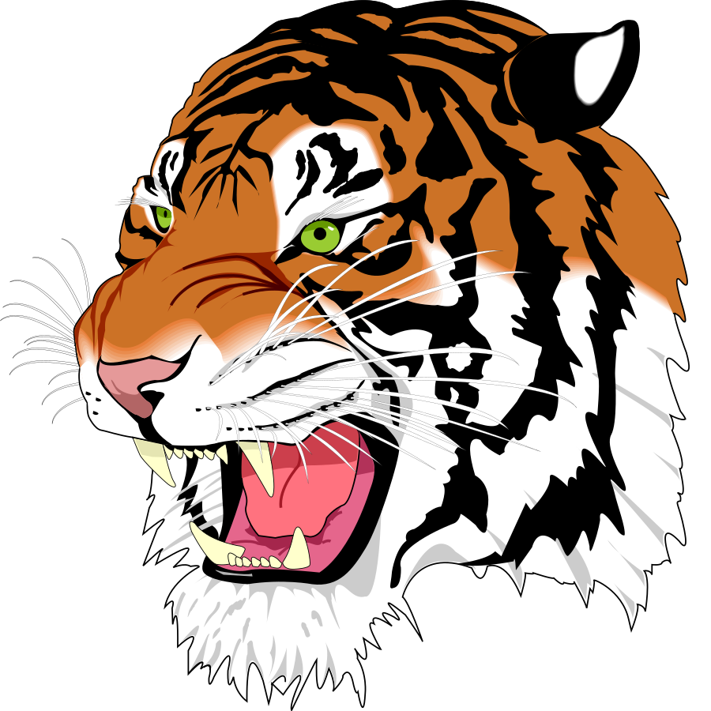

## Basic

## Caption

A caption with **bold** and _italic_ text.

## Dark mode variant

Toggle system dark mode to see the switch:

{:srcDark="../../../assets/test-dark.jpeg"}

## Background color

{:background="#e8e4d0"}

## Background with dark mode

{:background="#e8e4d0" backgroundDark="#2a2520"}

## Formats

### JPEG only

> [!WARNING]
> TODO ASTRO MDX KIT FIX

{/* {:formats="jpg" background="#e8e4d0"} */}

### WebP fallback

{:fallbackFormat="webp"}

## Layout modes

### Responsive (default)

{:layout="responsive"}

### Constrained

{:layout="constrained"}

### Fixed

{:layout="fixed"}

### Full-width

{:layout="full-width"}

### None

{:layout="none"}

## Background compositing

### SVG with background (transparent format)

{:background="#e8e4d0"}

### SVG with background (opaque format, composited)

> [!WARNING]
> TODO ASTRO MDX KIT FIX

{/* {:formats="jpg" background="#e8e4d0" backgroundDark="#2a2520"} */}

## Caption and credit

{:credit="Test Creator" creditOrganization="Test Org" creditMediaType="photo"}
Photo caption text.

## Zoom

Click to open lightbox:

{:zoom="true"}

## Zoom gallery

Multiple images sharing a gallery — click one, swipe between them:

{:zoom="gallery"}

{:zoom="gallery"}

## Tldraw integration

With automatic system `@media(prefers-color-scheme)` dark mode support

With Starlight-compatible `[data-theme='dark']` dark mode support

{:darkMode="[data-theme='dark']"}

With disabled dark mode support

{:darkMode="none"}

## Aphex (Apple photos) integration

