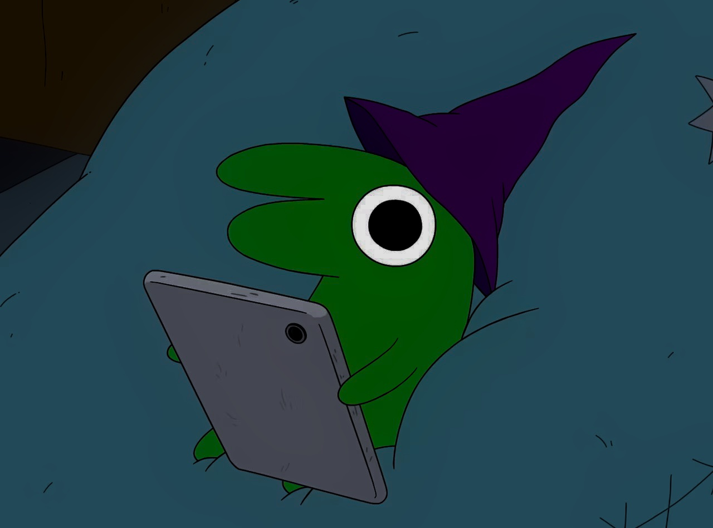

## Single image zoom

Click to open lightbox:

{:zoom="true"}

{:zoom="true"}

## Named gallery

All images share `zoom="album"` — click one, swipe between them:

{:zoom="album"}

{:zoom="album"}

{:zoom="album"}

## Mixed media gallery

Images and video in the same gallery:

{:zoom="mixed"}

:::Video{src="/test.mp4" zoom="mixed"}
:::

{:zoom="mixed"}

## Scoped galleries

Use `zoomScope` to limit gallery boundaries by CSS selector. Each matching ancestor creates a separate gallery, even with the same gallery name.

### Separate galleries per section

Each `<section>` gets its own independent gallery:

<section>

{:zoom="scoped" zoomScope="section"}

{:zoom="scoped" zoomScope="section"}

</section>

<section>

{:zoom="scoped" zoomScope="section"}

{:zoom="scoped" zoomScope="section"}

</section>

### Standalone with scope

When `zoom` is `true` (no gallery name), `zoomScope` groups items under the same ancestor instead of opening them as standalone lightboxes:

{:zoom="true" zoomScope=".scope-demo"}

{:zoom="true" zoomScope=".scope-demo"}

